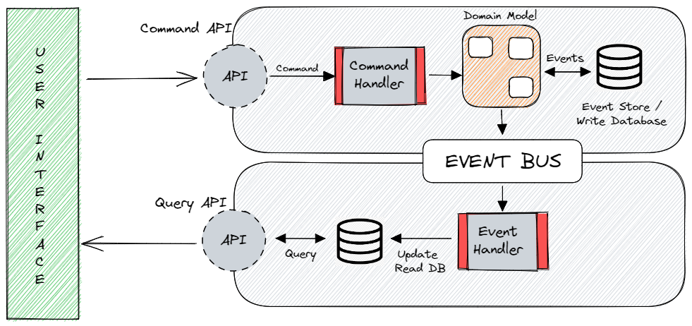
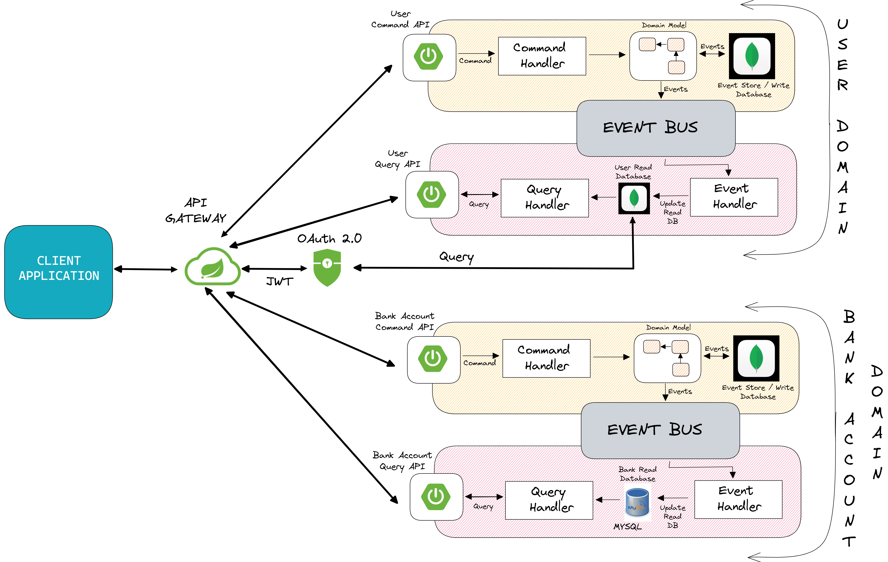

# Microservices using CQRS( Command Query Responsibility Segregation ) and Event Sourcing

## CQRS
CQRS is a software design pattern that stands for command query responsibility segregation. As the name suggests, applications should be divided in a command and query part commands alters the status of an object or entity and queries return the state of an object or entity.
Instead of having a single interface for read and write operations, cqrs makes the altering and querying of data as separate concerns.

## Event Sourcing
Events sourcing defines an approach with all the changes that are made to an object or entity are stored as a sequence of immutable events to an event store as opposed to storing just the current state.
The event sourcing pattern is often used to the securest pattern to perform the data management tasks in response to events and by materializing views from the stored events.



<br>

## Microservices Architecture

<br>



<br>

## Project Setup

1) Setup Axon Server

```
docker run -d --name axon-server -p 8124:8124 --network myNet --restart always axoniq/axonserver:latest
```

2) Run MongoDB in Docker
```
docker run -it -d --name mongo-container -p 27017:27017 --network myNet --restart always -v mongodb_data_container:/data/db mongo:latest
```

3) Run MySQL in Docker
```
docker run -it -d --name mysql-container -p 3306:3306 --network myNet -e MYSQL_ROOT_PASSWORD=myNetRootPsw --restart always -v mysql_data_container:/var/lib/mysql mysql:latest
```

4) Run Adminer in Docker
```
docker run -it -d --name adminer -p 8080:8080 --network myNet -e ADMINER_DEFAULT_SERVER=mysql-container --restart always adminer:latest
```

5) Build the docker images in respective microservices containing dockerfile

```
docker build -t user-oauth2 .
docker build -t user-cmd-api .
docker build -t user-query-api .
docker build -t bankacc-cmd-api .
docker build -t bankacc-query-api .
docker build -t api-gateway .
```

Run the microservices in docker using docker compose
```
cd docker/myNet
docker-compose up -d
```